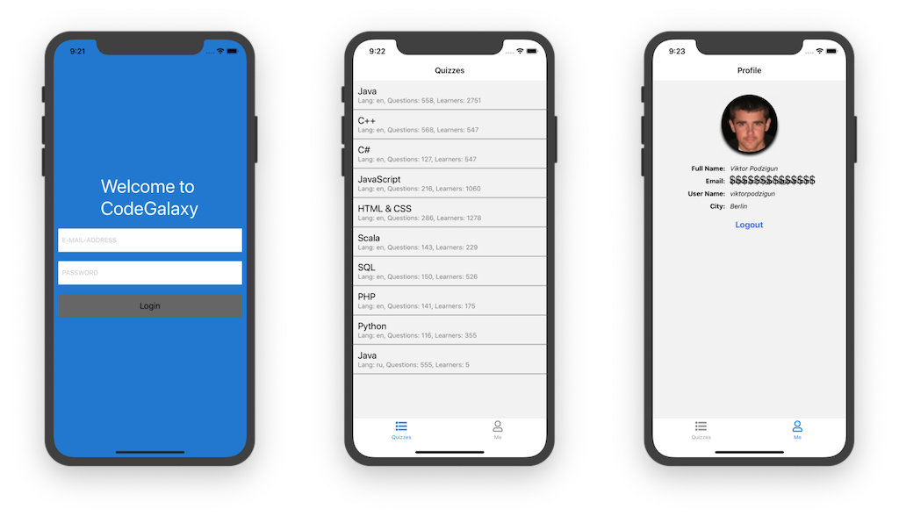

[](https://github.com/ExplainLabs/codegalaxy-app/actions/workflows/ci.yml?query=workflow%3Aci+branch%3Amaster)
[](https://coveralls.io/github/ExplainLabs/codegalaxy-app?branch=master)
[](https://www.scala-js.org)

## codegalaxy-app
Mobile App for https://codegalaxy.io/



### How to open it in your device (Android)

* [live expo link](https://expo.io/@viktorpodzigun/codegalaxy-app)

### Initial Setup:

Please, make sure you have `Node.js` **version 12.x** installed locally.

Then, please make sure you have `expo-cli` **version 4** installed
globally:
```bash
npm i expo-cli@4 -g
```

Then you can run following commands to init the project:

```bash
cd app
npm install
#Or
expo install
```

NOTE: when upgrading/re-installing the project perform these commands **first**:
```bash
sbt clean

cd app
rm -rf node_modules
rm package-lock.json
```

#### Android Emulator Setup

For android emulator, please, follow these instructions:
* [Android emulator expo link](https://docs.expo.io/workflow/android-studio-emulator/)

#### How to Build/Run App locally using Expo

First, build the application with the following command:
```bash
sbt "project codegalaxy-app" fastOptJS
```

Then you can run it in emulator:
```bash
cd app
expo start --ios
#or:
expo start --android
```

#### How to Run App with reload workflow

First, build app with reload in sbt
```bash
sbt -mem 2048
sbt> project codegalaxy-app
codegalaxy-app> ~fastOptJS
```

Then, refresh app in Expo client:
* Cmd+R in emulator (if FastRefresh is disabled)
* or shake real device and press Reload in then menu

